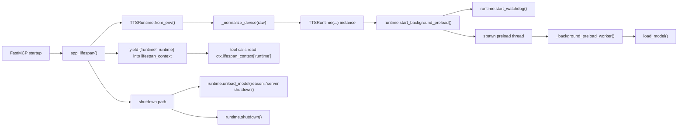
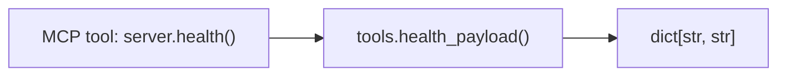
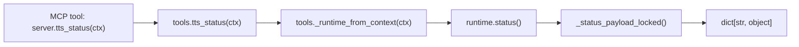
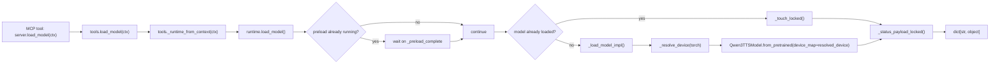
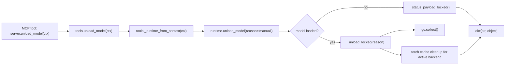
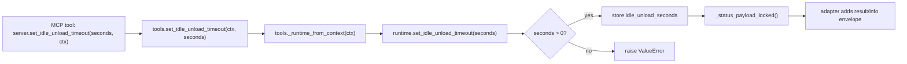
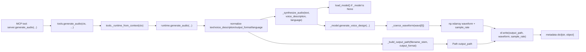
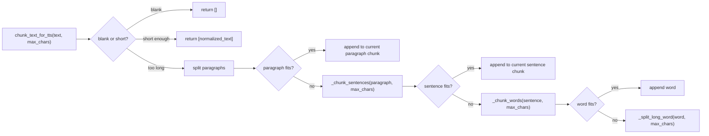

# Tool Workflows

`WORKFLOWS.md` is the implementation-oriented map of the live MCP tool surface in this repo. It documents the current wired paths only: the FastMCP entrypoints in `app/server.py`, the adapter layer in `app/tools.py`, the runtime in `app/runtime.py`, and the chunking helpers in `app/text_chunking.py`.

## How To Read This

- Diagrams use Mermaid `flowchart LR`.
- Each diagram follows the real call chain from the MCP tool entrypoint down into the runtime/helper functions it depends on.
- `Input -> Output` notes call out the points where data shape or type changes.
- Error notes distinguish between tools that convert exceptions into error payloads and tools that let exceptions bubble.

## Shared Lifespan Flow

### Flow

The server creates one `TTSRuntime` for the process during the FastMCP lifespan hook in `app/server.py`. That runtime is stored in the lifespan context and every tool resolves it later through `ctx.lifespan_context["runtime"]`.

Startup also begins two background behaviors immediately:

- the idle watchdog thread, which periodically checks whether the loaded model has been idle long enough to unload
- the preload thread, which opportunistically runs `load_model()` before the first synthesis call

On shutdown, the server unloads the model and then stops/join the background threads.

### Data Shape Transitions

- environment variables `dict[str, str | None]` -> normalized runtime constructor inputs `str | int | Path`
- runtime constructor inputs -> `TTSRuntime`
- `TTSRuntime` -> lifespan payload `dict[str, TTSRuntime]`
- lifespan payload -> per-tool `Context.lifespan_context`

## `health`

### Flow

`health` is the shortest path in the repo. The FastMCP entrypoint calls `health_payload()` and returns its result unchanged.

### Data Shape Transitions

- no tool input payload -> health payload `{"status": str, "timestamp": str}`

### Errors

This path does not wrap errors because it only builds a small in-process dictionary.

## `tts_status`

### Flow

`tts_status` resolves the shared runtime from the FastMCP context and returns the runtime status snapshot. The runtime holds the lock while constructing the payload so the fields reflect one coherent state.

### Data Shape Transitions

- `Context` -> `TTSRuntime`
- runtime internal fields -> status payload `dict[str, object]`
- internal `datetime | None` fields -> serialized ISO-8601 strings or `None`
- internal `Path` output directory -> `str`

### Errors

If the runtime is missing from lifespan context, `_runtime_from_context()` raises `RuntimeError`. `tts_status` does not convert that failure into an error payload.

## `load_model`

### Flow

`load_model` is an adapter-wrapped runtime call. The adapter resolves the runtime, calls `runtime.load_model()`, and catches exceptions so the MCP caller receives a structured error payload instead of a raised exception.

Inside the runtime, `load_model()` either:

- waits for the background preload thread to finish if it is already loading on another thread
- refreshes usage timestamps if the model is already loaded
- or loads the model directly through `_load_model_impl()`

The actual model load path resolves the device and then calls `Qwen3TTSModel.from_pretrained(...)`.

### Data Shape Transitions

- `Context` -> `TTSRuntime`
- runtime state -> load result payload `dict[str, object]`
- `device_preference: str` + torch backend availability -> resolved device `str`
- model identifier `str` + resolved device `str` -> loaded model object in `_model`

### Errors

- adapter behavior: exceptions become `{"result": "error", "loaded": False, "error": str(exc), ...status}`
- runtime behavior: `_load_model_impl()` exceptions are recorded in `last_error` and re-raised

## `unload_model`

### Flow

`unload_model` also uses an adapter try/except wrapper. If a model is present, the runtime clears `_model`, records `last_unloaded_at`, runs garbage collection, and empties backend caches for MPS or CUDA when available.

### Data Shape Transitions

- `Context` -> `TTSRuntime`
- runtime loaded model state -> unloaded status payload `dict[str, object]`
- internal unload timestamps `datetime` -> serialized strings in the returned payload

### Errors

- adapter behavior: exceptions become `{"result": "error", "loaded": True, "error": str(exc), ...status}`
- runtime behavior: most unload logic is best-effort and does not raise if `torch` is unavailable during cache cleanup

## `set_idle_unload_timeout`

### Flow

The adapter calls the runtime setter and wraps the updated runtime status with a small success envelope. This is one of the clearer examples of a shape change added by the adapter layer.

### Data Shape Transitions

- MCP scalar input `seconds: int` -> runtime state mutation `idle_unload_seconds: int`
- runtime status payload `dict[str, object]` -> adapter result payload `{"result": "success", "info": str, ...status}`

### Errors

- adapter behavior: exceptions become `{"result": "error", "error": str(exc), ...status}`
- runtime behavior: non-positive integers raise `ValueError("seconds must be greater than zero")`

## `generate_audio`

### Flow

`generate_audio` is the explicit file-producing path. The tool adapter resolves the runtime and catches exceptions, but the runtime does the interesting work:

1. validate and normalize user-facing inputs
2. derive the final output path
3. synthesize the waveform in memory through `_synthesize_audio()`
4. write the waveform to disk with `soundfile`
5. return metadata about the generated file

`_synthesize_audio()` is shared with `runtime.speak_text()`, so generation and playback share one synthesis path up to the point where the waveform is either written to disk or sent to `sounddevice`.

### Data Shape Transitions

- MCP tool inputs `text: str`, `voice_description: str`, `language: str`, `output_format: str`, `filename_stem: str | None` -> normalized scalar values
- `language: str` -> normalized language alias `str` such as `English`, `Chinese`, or `Auto`
- `filename_stem: str | None` + `output_format: str` -> `Path`
- model output `(wavs, sample_rate)` -> first waveform object `Any`
- waveform object `Any` -> `np.ndarray[np.float32]`
- `np.ndarray` + `sample_rate: int` + `Path` -> persisted audio file on disk
- runtime synthesis metadata -> adapter-facing result payload `dict[str, object]`

### Errors

- adapter behavior: exceptions become `{"result": "error", "error": str(exc), ...status}`
- runtime validation raises for empty text, empty voice description, or unsupported output format
- synthesis errors set `last_error` before re-raising

## `speak_text`

### Flow

`speak_text` is the most layered path in the repo and the only tool registered as a required FastMCP background task.

The adapter layer:

1. resolves the runtime from context
2. chunks the input text
3. initializes FastMCP task progress
4. iterates over the chunk queue in FIFO order
5. hands each chunk to `runtime.speak_text()` through `asyncio.to_thread(...)`
6. accumulates per-chunk playback metadata
7. assembles one aggregate result payload after the last chunk

The runtime path for each chunk:

1. validates and normalizes the chunk input
2. synthesizes audio in memory through `_synthesize_audio()`
3. passes the waveform buffer directly to `sounddevice`
4. waits for playback completion
5. returns chunk playback metadata

Unlike older disk-backed playback designs, this path does not persist temporary audio files.

### Data Shape Transitions

- input `text: str` -> `list[str]` chunk list
- `list[str]` -> `deque[str]`
- `deque[str]` -> one chunk `str` per loop iteration
- async task state -> progress side effects through `Progress.set_total()`, `set_message()`, and `increment()`
- chunk `str` -> worker-thread runtime call through `asyncio.to_thread(...)`
- normalized chunk inputs -> runtime synthesis metadata `dict[str, object]`
- model output `(wavs, sample_rate)` -> `np.ndarray[np.float32]` waveform + `int` sample rate
- waveform buffer + sample rate -> host playback side effect through `sd.play()` / `sd.wait()`
- runtime playback result `dict[str, object]` -> per-chunk record `dict[str, object]` with adapter-added `index`, `text`, and `text_length`
- `list[dict[str, object]]` -> final aggregate success payload `dict[str, object]`
- per-chunk durations `list[float]` -> summed `duration_seconds: float`

### Errors

- adapter behavior: blank input after chunking raises `ValueError("text must not be empty")`
- unlike the synchronous adapter tools, `tools.speak_text()` does not wrap exceptions into `{"result": "error"}` payloads
- runtime validation and synthesis/playback failures therefore bubble out of the task

## Chunking Helper Flow

### Flow

The chunker prefers semantic boundaries in this order:

1. keep the entire text intact if it already fits
2. split by paragraph boundaries
3. split oversized paragraphs by sentence boundaries
4. split oversized sentences by words
5. hard-split a single overlong word when no softer boundary remains

This helper is used only by `tools.speak_text()` today, but it is an important part of the end-to-end playback behavior because it determines both progress totals and FIFO chunk order.

### Data Shape Transitions

- raw input `text: str` -> stripped `normalized: str`
- long normalized string -> `list[str]` paragraph candidates
- oversized paragraph `str` -> `list[str]` sentence chunks
- oversized sentence `str` -> `list[str]` word chunks
- oversized word `str` -> `list[str]` hard-split segments
- accumulated mutable `current: str` values -> final `list[str]`
