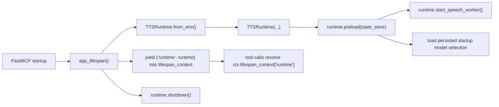
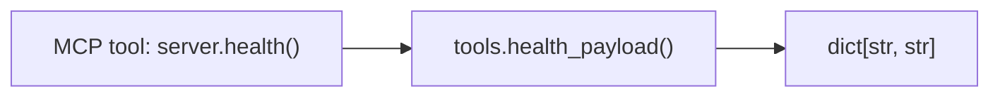
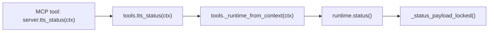
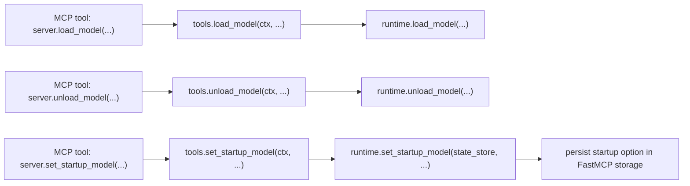
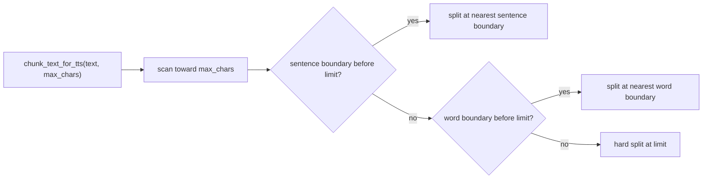

# Tool Workflows

`WORKFLOWS.md` documents the current MCP paths in this repo. It follows the implementation in `app/server.py`, `app/tools.py`, `app/runtime.py`, and `app/text_chunking.py`.

## Shared Lifespan Flow

The server creates one `TTSRuntime` per FastMCP process during lifespan setup. Preload starts the in-process speech worker, reads the persisted startup model option from FastMCP storage, and blocks until just those startup-selected models are loaded. The runtime is then shared by every tool call in that process and shut down when the server exits.

## `health`

`health` builds and returns a small in-process payload with no runtime interaction.

## `tts_status`

`tts_status` resolves the shared runtime from lifespan context and returns one lock-protected status snapshot.

Important status behavior:

- `speech_phase` is `idle` when no job is active.
- `speech_phase` is `synthesizing` while the model is generating audio for the active request.
- `speech_phase` is `opening_output` while the output stream is being opened.
- `speech_phase` is `playing` while waveform chunks are being written to the audio device.
- separate voice-design and clone model state is always reported.
- startup preload configuration is reported, including the persisted `startup_model_option`.
- recent structured runtime events are included for live diagnosis.

## Model Management

`load_model` and `unload_model` act on concrete model ids. `set_startup_model` persists one of `none`, `all`, or one concrete model id so the next server start knows which models to preload.

## `speak_text`

`speak_text` is the normal voice-design playback path. It first requires the voice-design model to already be loaded. If the client supports FastMCP elicitation, the tool can ask whether it should load the missing model; otherwise it returns an explicit load-first error. Once the model is ready, it enqueues one full text job and returns immediately.

## `speak_text_as_clone`

`speak_text_as_clone` is the ad hoc clone playback path. It reads a local reference clip, chooses clone mode from the presence of `reference_text`, and then enqueues one clone job into the same global playback queue used by `speak_text`.

Important clone behavior:

- without `reference_text`, the clone path uses `x_vector_only_mode=True`
- with `reference_text`, the clone path uses `x_vector_only_mode=False`
- clone playback uses the resident 0.6B clone model

## Speech Profiles

```mermaid
flowchart LR
    A["MCP tool: server.generate_speech_profile(...)"] --> B["tools.generate_speech_profile(ctx, ...)"]
    B --> C["tools._runtime_from_context(ctx)"]
    C --> D["decode reference audio"]
    D --> E["runtime.generate_speech_profile(...)"]
    E --> F["create Qwen voice clone prompt"]
    F --> G["serialize prompt tensors"]
    G --> H["store profile in FastMCP state store"]
```

Speech profiles are reusable named clone prompts persisted in FastMCP's underlying state store. They are bound to the active clone model ID at creation time.

```mermaid
flowchart LR
    A["MCP tool: server.speak_with_profile(...)"] --> B["tools.speak_with_profile(ctx, ...)"]
    B --> C["tools._runtime_from_context(ctx)"]
    C --> D["chunk_text_for_tts(text)"]
    D --> E["runtime.speak_with_profile(...)"]
    E --> F["load stored prompt artifact"]
    F --> G["enqueue one clone job with voice_clone_prompt"]
    G --> H["speech worker reads job"]
    H --> I["play_speech_chunks(...)"]
    I --> J["_model.generate_voice_clone(...)"]
```

`speak_with_profile` skips reference-audio decoding at request time and reuses the saved prompt artifact directly.

## Text Chunking

Chunking is now size-oriented rather than sentence-by-sentence. The chunker fills toward the configured character limit, prefers the nearest sentence boundary at or before that limit, then falls back to a word boundary, and only hard-splits when there is no softer break available.

## Shared Queue And Playback

All speech-producing tools share one in-process FIFO queue and one playback worker.

Important behavior:

- multiple MCP clients can stay connected at once
- only one speech job plays at a time
- one request keeps one output stream open while its chunks are synthesized and written in order
- playback audio is not persisted to disk unless a future file-producing path is explicitly added
- `tts_status` is the best live view into queue depth, active mode, recent events, and model readiness
