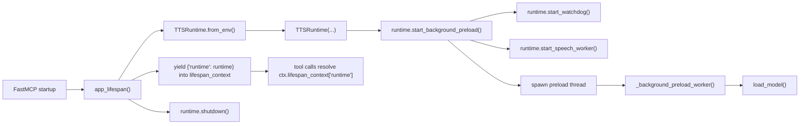
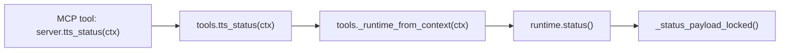
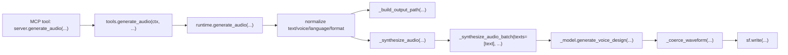
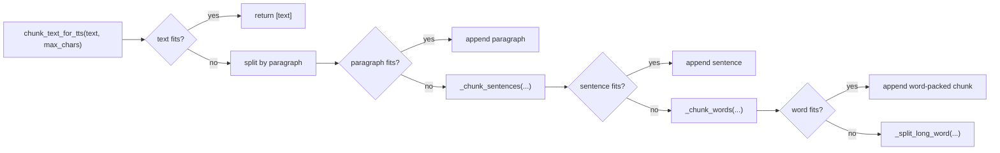

# Tool Workflows

`WORKFLOWS.md` documents the live MCP paths in this repo. It follows the real runtime flow in `app/server.py`, `app/tools.py`, `app/runtime.py`, and `app/text_chunking.py`.

## Shared Lifespan Flow

The server creates one `TTSRuntime` per FastMCP process during lifespan setup. The runtime is shared by every tool call in that process and shut down when the server exits.

## `health`

`health` builds and returns a small in-process payload with no runtime interaction.

## `tts_status`

`tts_status` resolves the shared runtime from lifespan context and returns one lock-protected status snapshot.

## `generate_audio`

`generate_audio` is the file-producing path. It normalizes inputs, synthesizes one waveform in memory, writes it to disk, and returns metadata about the generated file.

## `speak_text`

```mermaid
flowchart LR
    A["MCP tool: server.speak_text(...)"] --> B["tools.speak_text(ctx, ...)"]
    B --> C["chunk_text_for_tts(text)"]
    B --> D["runtime.enqueue_speech(...)"]
    D --> E["speech worker thread"]
    E --> F["runtime.play_speech_chunks(...)"]
    F --> G["_synthesize_audio_batch(texts=chunks, ...)"]
    G --> H["_model.generate_voice_design(...)"]
    H --> I["list[np.ndarray] waveforms"]
    I --> J["small playback preroll buffer"]
    J --> K["_open_output_stream(...)"]
    K --> L["_write_output_stream_chunk(...) in FIFO order"]
```

`speak_text` is a plain MCP tool. It chunks text only to stay within model-friendly text sizes, then hands the full chunk list to the runtime queue.

The background worker performs one model batch call for the full queued request, buffers a small initial amount of generated audio, opens one live output stream, and writes the generated waveforms to the host audio device in order.

Important behavior:

- one queue slot equals one full `speak_text` request
- one queued request results in one model batch call
- playback uses one output stream per queued request
- playback audio is not persisted to disk
- queue-full failures are retryable client-side backpressure, not permanent input errors

## Text Chunking

Chunking is paragraph-first, with sentence and word fallback only when needed. It is used by `speak_text` to prepare the input list for one batch synthesis request.
