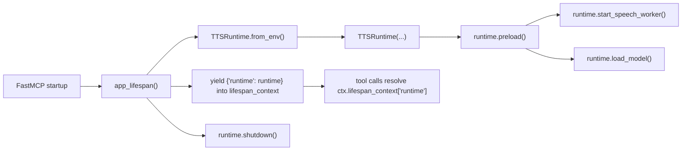
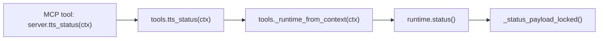
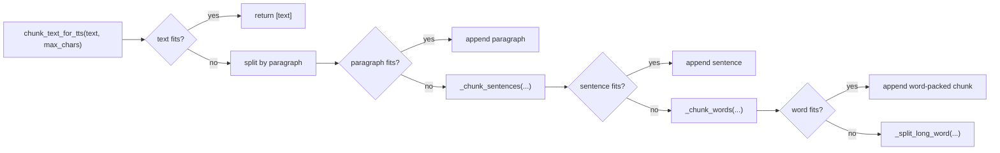

# Tool Workflows

`WORKFLOWS.md` documents the live MCP paths in this repo. It follows the current implementation in `app/server.py`, `app/tools.py`, `app/runtime.py`, and `app/text_chunking.py`.

## Shared Lifespan Flow

The server creates one `TTSRuntime` per FastMCP process during lifespan setup. Preload starts the in-process speech worker and blocks until the model is resident. The runtime is then shared by every tool call in that process and shut down when the server exits.

## `health`

`health` builds and returns a small in-process payload with no runtime interaction.

## `tts_status`

`tts_status` resolves the shared runtime from lifespan context and returns one lock-protected status snapshot.

Important status behavior:

- `speech_phase` is `idle` when no job is active.
- `speech_phase` is `synthesizing` while the model is generating audio for the active request.
- `speech_phase` is `opening_output` while the output stream is being opened.
- `speech_phase` is `playing` while waveform chunks are being written to the audio device.

## `speak_text`

`speak_text` is a plain MCP tool. It enqueues one full text request exactly as sent by the caller. Playback then happens on the already-running in-process worker.

Important behavior:

- one `speak_text` call creates one queued playback job
- one playback job results in one model batch call
- playback uses one output stream per speech request
- playback audio is not persisted to disk
- `speech_phase` exposes whether the job is still synthesizing or has reached playback

## Text Chunking

Chunking is paragraph-first, with sentence and word fallback only when needed. It is used when longer text needs to be split into model-friendly chunks before one batched synthesis request.
